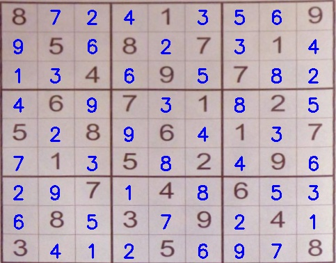

# OCR Sudoku Solver
Solve the sudoku puzzle from an image using OCR of Digits and Computer Vision

## Steps involved in the working
1. Provide input image containing Sudoku puzzle to our system.
2. Locate the sudoku puzzle board in the image and extract it.
3. Given the board, locate each of the individual cells of the Sudoku board (most standard Sudoku puzzles are a 9×9 grid, so we’ll need to localize each of these cells).
4. Determine if a digit exists in the cell, and if so, OCR it.
5. Apply a Sudoku puzzle solver/checker algorithm to validate the puzzle.
6. Display the output result to the user.

* Steps 1, 2 and 3 are accomplished using OpenCV and other Computer Vision and Image Processing Libraries.
* To OCR the digits from the cell of the board, I have trained a Deep Learning CNN model called SudokuNet using keras and tensorflow to classify the digits
* The **Dataset** used for this model is a subset of [Chars74K image dataset](http://www.ee.surrey.ac.uk/CVSSP/demos/chars74k/)
* After OCR of digits, the sudoku puzzle is solved using Backtracking algorithm.
* I have well documented my code using comments wherever necessary. Do read the code for further clarification.

#### Do check out my repository on solving the sudoku puzzle using Backtracking algorithm :point_right: [Sudoku Solver Backtracking](https://github.com/GaneshSparkz/Sudoku-Solver-Backtracking)

## Steps for executing the code
### 1. Clone this repository
```Shell
git clone https://github.com/GaneshSparkz/OCR-Sudoku-Solver.git
```

### 2. Navigate to the working directory
```Shell
cd OCR-Sudoku-Solver
```

### 3. Install the requirements
```Shell
pip install -r requirements.txt
```

### 4. Run the solve_sudoku.py file
```Shell
python solve_sudoku.py -m trained_model/digit_classifier.h5 -i sudoku.jpg
```
To visualize each step in the process, set the debug flag to 1 :point_down:
```Shell
python solve_sudoku.py -m trained_model/digit_classifier.h5 -i sudoku.jpg -d 1
```
The command line arguments to be used are... :point_down:
```Shell
usage: solve_sudoku.py [-h] -m MODEL -i IMAGE [-d {0,1}]

optional arguments:
  -h, --help            show this help message and exit
  -m MODEL, --model MODEL
                        path to the trained digit classifier model
  -i IMAGE, --image IMAGE
                        path to the image containing the sudoku puzzle
  -d {0,1}, --debug {0,1}
                        set to 1 to visualize each step of the process
                        (default: 0)
```
**The model is already trained and the trained model (.h5 file) is uploaded in trained_model/ directory**

### 5. Result
Input image:


```Shell
Using TensorFlow backend.
[INFO] loading digit classifier...
[INFO] processing image...
[INFO] The recognized Sudoku board...
+-----------------------+
| 8     |   1   |     9 |
|   5   | 8   7 |   1   |
|     4 |   9   | 7     |
+-----------------------+
|   6   | 7   1 |   2   |
| 5   8 |   6   | 1   7 |
|   1   | 5   2 |   9   |
+-----------------------+
|     7 |   4   | 6     |
|   8   | 3   9 |   4   |
| 3     |   5   |     8 |
+-----------------------+
[INFO] solving the sudoku puzzle...
[INFO] solved...
[INFO] Sudoku board after solving...
+-----------------------+
| 8 7 2 | 4 1 3 | 5 6 9 |
| 9 5 6 | 8 2 7 | 3 1 4 |
| 1 3 4 | 6 9 5 | 7 8 2 |
+-----------------------+
| 4 6 9 | 7 3 1 | 8 2 5 |
| 5 2 8 | 9 6 4 | 1 3 7 |
| 7 1 3 | 5 8 2 | 4 9 6 |
+-----------------------+
| 2 9 7 | 1 4 8 | 6 5 3 |
| 6 8 5 | 3 7 9 | 2 4 1 |
| 3 4 1 | 2 5 6 | 9 7 8 |
+-----------------------+
```
Output:



### If you want to train the model, follow these steps :point_down:
1. Download the dataset from this link :point_right: [Dataset](https://drive.google.com/file/d/1ysIQhQB8NT6nVkaO0FAr4BU1oOOhvZlR/view?usp=sharing)
2. Unzip the file and place the dataset folder in the working directory
3. Edit the model architecture if required in **utils/model.py** file.
4. Edit the hyperparameters used if required in **train.py** file as given below.
  * Lines 24 - 27
```Python
# initializing the hyperparameters like learning rate, number of epochs
# and batch size
LR = 1e-3
EPOCHS = 10
BATCH_SIZE = 50
STEPS_PER_EPOCH = 2000
```
  * Lines 69 - 75
```Python
# augment the data
data_gen = ImageDataGenerator(
    width_shift_range=0.1,
    height_shift_range=0.1,
    rotation_range=10,
    shear_range=0.1,
    zoom_range=0.2
)
```

5. Run the train.py file
```Shell
python train.py -o trained_model/digit_classifier.py
```
The command line arguments to be used are... :point_down:
```Shell
usage: train.py [-h] -o OUTPUT

optional arguments:
  -h, --help            show this help message and exit
  -o OUTPUT, --output OUTPUT
                        path to save the trained model file
```

#### Give this repo a star :star: if you like it!
